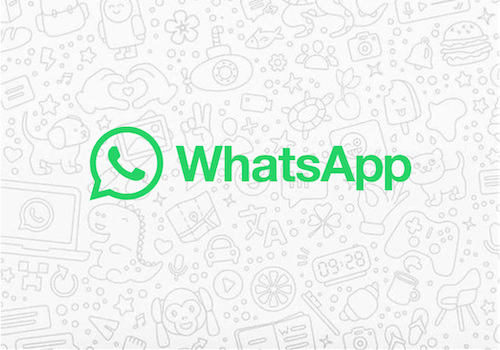

  

  
**WhatsApp for Homey**

WhatsApp for Homey is a complete integration without the intervention of a bot. With this Homey app, you send messages, videos, photos, documents to a mobile number or WhatsApp group from your own name.

Currently has support for:
* :heavy_plus_sign: Send from your personal number to Groups or a mobile number
* :speech_balloon: Send Text Messages
* :rice_scene: Send Images (by tag or url)
* :page_facing_up:  Send Documents
* :video_camera: Send Video
  
---

[Download in the Homey App Store!](https://homey.app/en-us/app/com.whatsapp/WhatsApp/)

<APP ACTION CARD>

:gear:  Install this app on your Homey and add a new WhatsApp device. Follow the instructions in the setup. (TIP: Use Homey Webapp. You need your phone to scan the QR code)

<APP FLOW CARDS>

:speech_balloon: Supported languages:

:uk: English  
:netherlands: Dutch  
:de: German  
:fr: french  
:it: Italian  
:sweden: Swedish  
:norway: Norwegian  
:es: Spanish  
:denmark: Danish  
:ru: Russian  
:poland: Polish  
  
---
🚨 Disclaimer 🚨:
1) You are the only one responsible for the messages and the content that you sent. Remember that messages will be sent from your phone number.
2) This app is not responsible for any <strong>ban or block</strong> performed by WhatsApp on your number. And the developer cant do anything to unblock it
3) Never send a Whatsapp message to a new conversation. Make sure the conversation had interaction with your number before you send a message from this app
4) This project is not affiliated, associated, authorized, endorsed by, or in any way officially connected with WhatsApp or any of its subsidiaries or its affiliates. The official WhatsApp website can be found at https://whatsapp.com. 'WhatsApp' as well as related names, marks, emblems and images are registered trademarks of their respective owners

---

Technical Info:

- This app uses WhiskeySockets/Baileys as a Whatsapp client. This client is based on the WhatsApp Web API. This client is not affiliated with WhatsApp Inc. in any way.